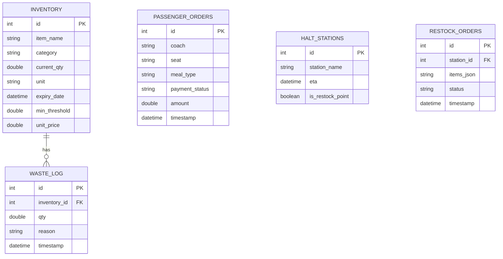

# Database Schema - RailPantry (SQLite)

## 1. ER Diagram (Conceptual)

## 2. Table Definitions

### 2.1 Table: `inventory`
Store initial load and current stock.
- `id`: INTEGER PRIMARY KEY AUTOINCREMENT
- `name`: TEXT NOT NULL
- `category`: TEXT (Dairy, Meals, Beverages, Snacks)
- `current_qty`: REAL
- `unit`: TEXT (pcs, kg, liters)
- `expiry_date`: DATETIME
- `min_threshold`: REAL
- `price_per_unit`: REAL

### 2.2 Table: `waste_log`
Track every wastage event.
- `id`: INTEGER PRIMARY KEY AUTOINCREMENT
- `item_id`: INTEGER (FK inventory.id)
- `qty`: REAL
- `reason`: TEXT (Expired, Spoiled, Overcooked, Passenger Return, Dropped)
- `timestamp`: DATETIME DEFAULT CURRENT_TIMESTAMP

### 2.3 Table: `passenger_orders`
Track meal distribution and revenue.
- `id`: INTEGER PRIMARY KEY AUTOINCREMENT
- `coach`: TEXT
- `seat`: TEXT
- `meal_type`: TEXT
- `payment_status`: TEXT (Paid, Pending, Prepaid)
- `amount`: REAL
- `timestamp`: DATETIME DEFAULT CURRENT_TIMESTAMP

### 2.4 Table: `halts`
Route management.
- `id`: INTEGER PRIMARY KEY AUTOINCREMENT
- `station_name`: TEXT
- `eta`: DATETIME
- `is_restock_point`: INTEGER (0 or 1)
