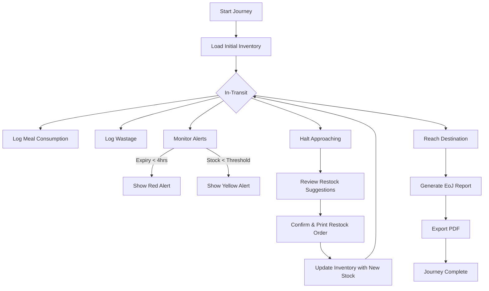

# Application Flow - RailPantry

## 1. Journey Lifecycle
The application models the lifecycle of a single train journey.

## 2. Key Interactions

### 2.1 Inventory Update Flow
1. User prepares 50 Veg Meals.
2. User clicks "Log Consumption" -> selects "Veg Meal" -> Qty 50.
3. System fetches Recipe (e.g., Rice, Dal, Paneer, Curd).
4. System deducts specific quantities from `inventory` table.
5. UI updates progress bar and meal count.

### 2.2 Alert Execution Flow
1. Background `ScheduledExecutorService` triggers every 15 minutes.
2. Queries `SELECT * FROM inventory WHERE expiry_date <= datetime('now', '+4 hours')`.
3. If results found, UI displays a non-blocking floating notification or dialog box.
4. User logs the item as "Waste" once handled.

### 2.3 Restocking Flow
1. System tracks "Current Station" (Simulated by timer or manual update).
2. For "Next Station" (e.g., Kota), system calculates:
   `OrderQty = (AvgDemandPerHour * RemainingJourneyHours) - CurrentStock`.
3. User edits "Final Order" and clicks "Confirm".
4. PDF/Text slip is generated for the station vendor.
